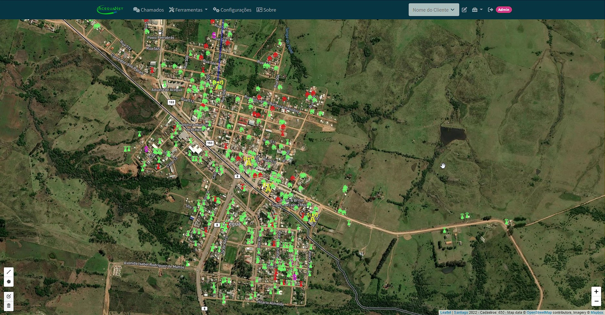

# Mapa Provedor (Geolocalização de Clientes, Pontos, etc.)

<!---Esses são exemplos. Veja https://shields.io para outras pessoas ou para personalizar este conjunto de escudos. Você pode querer incluir dependências, status do projeto e informações de licença aqui--->

> Mapa para provedor de internet, com informação dos clientes em tempo real. Informações MikroTik [IXCProvedor](https://www.ixcsoft.com.br/ixcprovedor/).

### Ajustes e melhorias

O projeto ainda está em desenvolvimento e as próximas atualizações serão voltadas nas seguintes tarefas:

- [x] Desenvolvimento inicial
- [x] Melhoria na no carregamento do mapa
- [x] Funções de API
- [ ] Pesquisa de Chamados pela proximidade 
- [ ] Melhoria geral

## 💻 Pré-requisitos

Antes de começar, verifique se você atendeu aos seguintes requisitos:
<!---Estes são apenas requisitos de exemplo. Adicionar, duplicar ou remover conforme necessário--->
* Apache 2 ou Nginx
* PHP 5.4 ou superior
* MariaDB.
* Atualmente funcioando com a API do IXC Provedo (Informações de clientes, etc). [Wiki API do IXCProvedor.](https://wikiapiprovedor.ixcsoft.com.br/).

## 📝 Licença
Projeto realizado para estudo e pesquisa, sem fins lucrativos.

Esse projeto está sob licença. Veja o arquivo [LICENÇA](LICENSE.md) para mais detalhes.

## 💻 Feito com
* PHP
* Baseado em Bootstrap e Bootswatch
* Leaflet.js
* OpenStreetMap
* MapBox
* Jquery

[⬆ Voltar ao topo](#mapa_provedo) 
